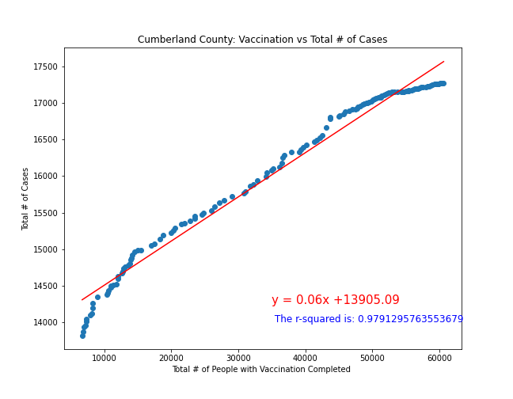

## Project Title: Analysis of # of Covid-19 Cases vs. Several Different Factors
* Name of Group: Pandemic Solvers
* Team Members: Dasa Simova, Joshua Pohl, Melissa Diep, Shuchi Khandelwal, Paul Shelffo

## Project Description/Outline
* Our team wanted to analyze the # of Covid-19 cases in NJ by county, and the correlation that population size, # of hospitalizations, # of vaccinations, gender, and age has had in the # of cases per NJ county.

## Research Questions & Hypotheses
1. What is the correlation between population size and # of cases?
    - Hypothesis: positive correlation
2. What is the correlation between # of hospitalizations and # of cases?
    - Hypothesis: positive correlation
3. What is the correlation between # of vaccinations and # of cases?
    - Hypothesis: negative correlation
4. What is the correlation between gender and # of cases?
    - Hypothesis: gender impacts # of cases
6. What is the correlation between age and # of cases?
    - Hypothesis: age impacts # of cases

## Data Sources
1. CDC Data (June '21 data) - API
    - https://data.cdc.gov/resource/n8mc-b4w4.json?
    - Use: metrics for # of cases, # of hospitalizations by NJ county
2. USAfacts Data (7-15-21) - CSV
    - https://usafacts.org/visualizations/coronavirus-covid-19-spread-map/state/new-jersey
    - Use: cumulative # of Covid-19 cases by NJ county
4. Population Data (2019) - API
    - www.census.gov
    - Use: population data by NJ county
6. Vaccination Data - CSV
    - www.api.covidactnow.org
    - Use: metrics for vaccinations, new cases per day, cumulative cases by NJ county

## Research Qs 1/2 - What is the correlation between pop. and hosp. with # of cases?

### ***Data Sources & Cleaning up the Data***
#### I. CDC Data (June '21 data) 
* To make the data size smaller, we filtered for June '21 as our sample for analysis. Per the API documentation provided, the new url became: https://data.cdc.gov/resource/n8mc-b4w4.json?res_state=NJ&case_month=2021-06&$limit=20000. We also dropped fields that were unrelated to the population and hospitalizations research questions. Next, we filtered the hospitalizations field for "Yes". 
#### II. USAfacts Data (7-15-21) 
* We wanted to further prove any hypothesis made with population vs June 21 cases by comparing population to the total cumulative cases by NJ county. 
* We found the total cumulative cases for all states as of 7-15-21 in CSV format from USAfacts.
* We cleaned the data by filtering for just NJ cases, and dropped all fields except for the County name, County_Num, and cases as of 7-15-21. Most of the other columns represented # of cases as of a different date.
#### III. Population Data (2019) 
* We sourced Census API which includes the total population size by county as of 2019. This was the most up to date free data available.
* In preparation for future merging of the data, we formatted the data so that the necessary fields matched the same taxonomy of the CDC Data (example: County, County_Num).

### ***Merging the Data & Visualizations***
* We merged our CDC + USAfacts + Population data, and created a panda dataframe visualization in descending order from largest to smallest population size.
        
* We outputted linear regression and bar graph visualizations to show correlation between:

  ##### A. Population (2019) vs Cases (June 2021)

   ##### B. Population (2019) vs Cumulative Cases (as of 7-15-21)

   
   
   
   ##### C. Hospitalizations vs Cases (June 2021)

### ***Conclusions for Research Q1 & Q2***
* Research Q1 - Bar graphs and linear regressions support that there is strong correlation between population size and cases.
   * We can see from the bar graphs and consolidated panda dataframe that the most populated counties generally have the most # of cases
   * Linear regression shows a strong positive correlation between population size and cases with an r-squared > 0.95. 
* Research Q2 - Bar graphs and linear regressions support that there is a moderate correlation between hospitalizations and cases
   - We can see from the bar graph and consolidated panda dataframe that counties with the fewest # of cases have the lowest # of hospitalizations (i.e. Salem), however it is a bit unexpected that Passaic has one of the most # of hospitalizations at 63, since 5 other counties had more # of cases. Other factors must have contributed to Passaic's high # of hospitalizations. It is also unexpected that Monmouth with most # of cases as relatively low # of hospitalizations. This may be attributed to timing of each county's collection of the cases data. Perhaps not all cases are reflected yet in this data. 
   - Also, the linear regression shows a moderate correlation with an r-squared of 0.67. Passaic/Monmouth can also be seen as an outliers in this visualization, as their points are the most out of alignment with the line plot. 

## Research Question 3 - What is the correlation between # of vaccinations with # of cases?

### ***Data Sources & Cleaning the Data***
*  We sourced the vaccination data in csv format from www.api.covidactnow.org, in time series for each county. The full dataset consists of 11319 entries, for 21 counties, for 2020 and 2021 per day. After we collected the data, we dropped the data not related to the vaccination and the number of cases and also the rows which didn't provide data in the selected fields (NaN values). Final dataset has 2892 entries(rows). Further analyses were performed with the data about actual vaccination initiated, actual vaccination completed, actual new cases, and data pertaining to the identification of the county, and the day when the data was collected. 
* The term vaccination completed refers to the number of individuals who have received a single dose from a one-dose vaccine course,  or their second dose from a two-dose vaccine course; vaccination initiated refers to the number of individuals who have received only one dose from a two-dose vaccine course. 
* The vaccination time series data was used to showcase vaccination by date and  actual new cases by date by county in NJ. For the county with population vaccinated at the highest rate (Morris County) and at the lowest rate (Cumberland County) bar graph was selected to provide an outlook at the vaccination data vs actual new cases data.

### ***Merged Data & Other Visualizations***
* We merged vaccination data with population data and created a stacked bar graph to showcase the  percentage of population vaccination initiated and vaccination completed, with markers used to point the actual total cases in % of population by county,NJ.  
 
* We built a series of linear regression graphs by county in NJ. Our hypothesis assumes that there is a negative linear relationship - when vaccinations increase, the number of cases decreases. To show possible relationship between vaccination and the number of the cases of COVID two counties were chosen based on percentage of vaccinated people of total population in the county (results as in June 2021). 
1. The county with the highest percentage of vaccinated people - Morris County (67% vaccination initiated, 61% completed, 10% cases of total population). Linear regression and Pearson's correlation coeffient showcases strong linear relationship by the value of r, 0.867 and coefficient 0.98. However, the number of cases is flat starting at some point, and if it continues in that direction - it means, statistically, that even if we increase the number of the vaccinated people , the number of cases will not increase.
    
2. The county with the least percentage of vaccinated people - Cumberland County (47% vaccination initiated, 39% vaccination completed and 11.5% cases of total population). Linear regression and Pearson's coefficient showcases a stronger positive linear relationship ( r value is 0.97 and coefficient has value 0.99) than Morris County.  We can also notice the flattening in the data.     

### ***Conclusions for Research Q3***
* Research Q3 - Based on plots and line equations, with correlation coefficients calculated we can say there was a positive linear correlation between vaccination and the number of cases. However, the eventual flattening of the linear regression visualations and the stronger linear relationships for the least vaccinated (Cumberland) vs most vaccinated (Morris) county may indicate that more vaccinations do result in fewer cases over time. However, we should consider broader analysis and functions in this scenario to correctly observe and predict future scenarios. 

## Research Question 4 - What is the correlation between gender and # of cases?

### ***Data Sources & Cleaning the Data***
* 
* 

### ***Merged Data & Other Visualizations***
* 
* 

### ***Conclusions for Research Q4***
*  
* 

## Research Question 5 - What is the correlation between age and # of cases?

### ***Data Sources & Cleaning the Data***
* 
* 

### ***Merged Data & Other Visualizations***
* 
* 

### ***Conclusions for Research Q5***
* 
*  
